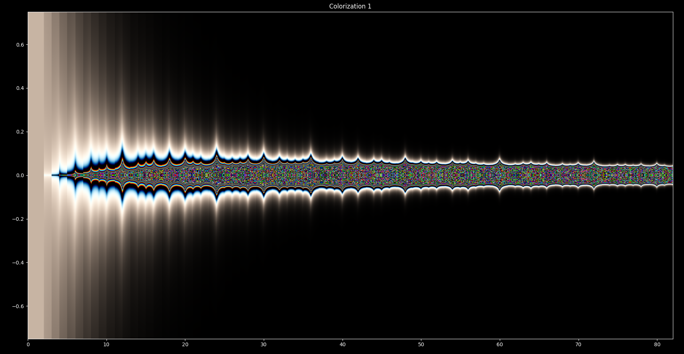
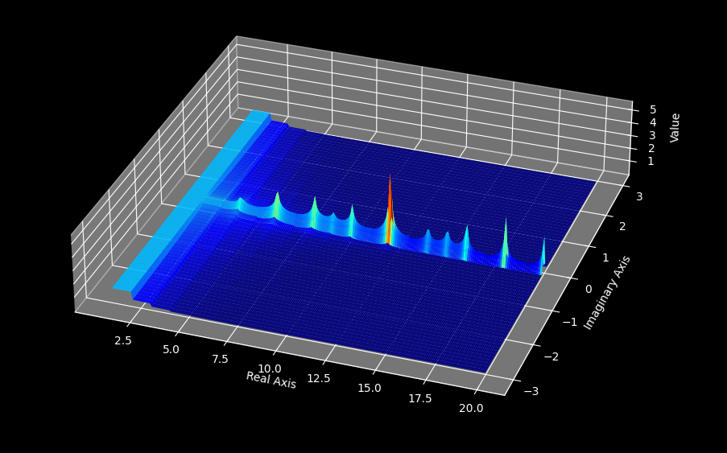
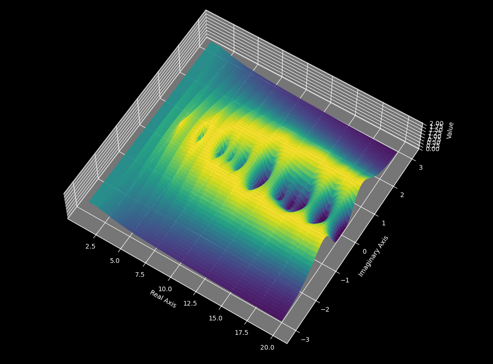
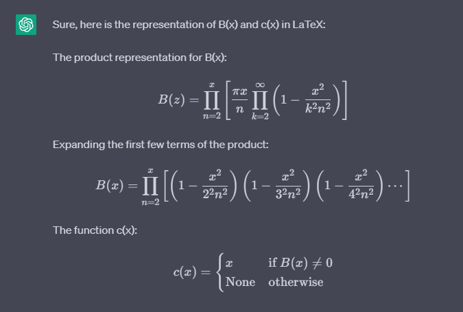

# Getting Started
If you have not already, please download the PDF called:
Divisor_Waves_and_their_Connection_to_the_Riemann_Hypothesis.pdf

https://drive.google.com/file/d/1YE2m8ZGhZ3fEVt8lzXobwmzg8F1c8xo4/view?usp=drivesdk

I have been working hard on these proofs for the past 3.5 years and now with the advent of ChatGPT, I have had an explosive amount of research.
The Special functions software is free and open source. I am also providing my chatgpt prompts so that others can learn from my prompt engineering examples.
  
If you want to learn more about the Riemann Hypothesis and the Millenium prize problems you can find them at the following sources:

Riemann Hypothesis:

https://mathworld.wolfram.com/RiemannZetaFunction.html

Clay Maths Institute's Millenium Prize Problems:

https://en.wikipedia.org/wiki/Millennium_Prize_Problems

# Special-Functions
A program for plotting complex functions. This tool provides the plotting functions for 2D and 3D graphics for infinite series such as the Riemann zeta function, 
the infinite product of the product representation for sin(pi*z/n) as well as any other function that can be formulated in the complex plane.

### Plot Of the Infinite Product of the Product Representation for Sin(pi*x/n) in the 2-D Complex Plane:

### Plot Of the Infinite Product of the Product Representation for Sin(pi*x/n) in the 3-D Complex Plane:

  
### Plot Of the Normalized Infinite Product of the Product Representation for Sin(pi*x/n) in the 3-D Complex Plane:

### Plot Of the Normalized Infinite Product of Sin(pi*x/n) in the 3-D Complex Plane:

# About Me
My name is Leo Borcherding, I am a Software Developer with experience working on programs for encryption of firmware devices. I have a background in electrical
engineering and my passion is mathematics as well as art. I am developing this software so that we can further our understanding of mathematics, physics, 
and the universe. Please contact me at borchborchmail@gmail.com if you have questions or are able to do something interesting with my software or math. You can also leave feedback on the software in this submission form:

https://docs.google.com/forms/d/e/1FAIpQLSedobin-e8XqIv2AgMWhIrcNq-Pm7fsD63rhjuEiksWMAe9Og/viewform?usp=sf_link

My End goal for this project is to use this data to train a language model plugin using GPT4, (Currently Im implementing a free gpt3.5 API from this github repo, because GPT4 is expensive to run for a long time, if I can find funding for this I would be able to do so much more: https://github.com/ayaka14732/ChatGPTAPIFree ) and the methods and information provided in this repository such that we can create an AI specialized in mathematical analysis for all fields of mathematics. Currently I have proposed the idea to the singularity group on @AtheneLive you can see the most recent twitch vod clip here where Lex fridman, Carli g, and Athene give their responses:

https://www.youtube.com/watch?v=JCCw1qNb3mc

Also you can find Athenes Twitch Here:

https://www.twitch.tv/athenelive

Currently I am writing a second paper on prompt engineering which showcases many examples of times where I utilized latex, python, and ascii prompts to formulate mathematical expressions with GPT3.5, ultimately this processes is dependent on the training or context referencing of the problem, and creating better systems for long term memory within a GPT4 agent will allow us to train a model such as "Euler Ai" which can process complex infinite series that it is trained on, and then in addition will be able to process new mathmatical functions that is was never presented if the user gives Euler enough context and formula evaluation techniques to fill in the blanks. Here is an example of the current capabilities of GPT3.5:

Ultimately knowledge should be free however it takes a lot of time and work to develop the mathematics, proofs and software required, I would really appreciate 
it, if you feel inclined to donate to help me keep developing this software and writing this paper. You can find the donation link in the file called bitcoin_donation_wallet.txt
