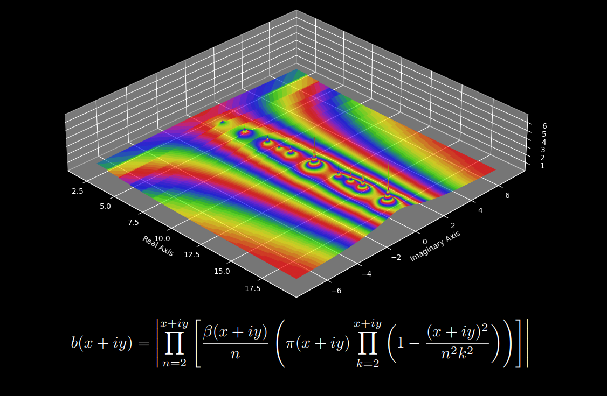
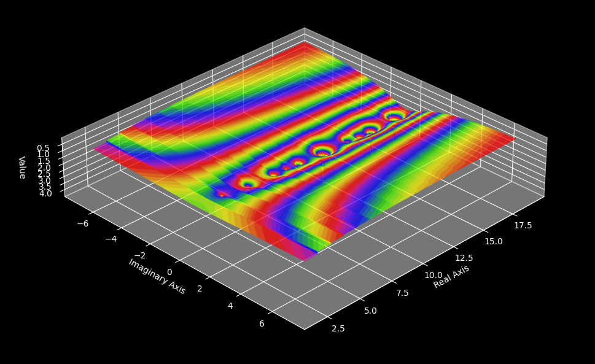
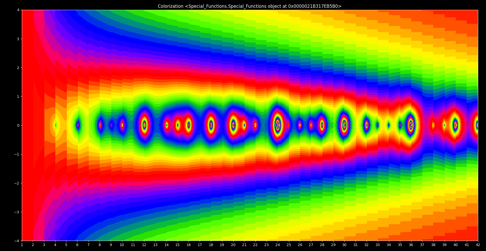
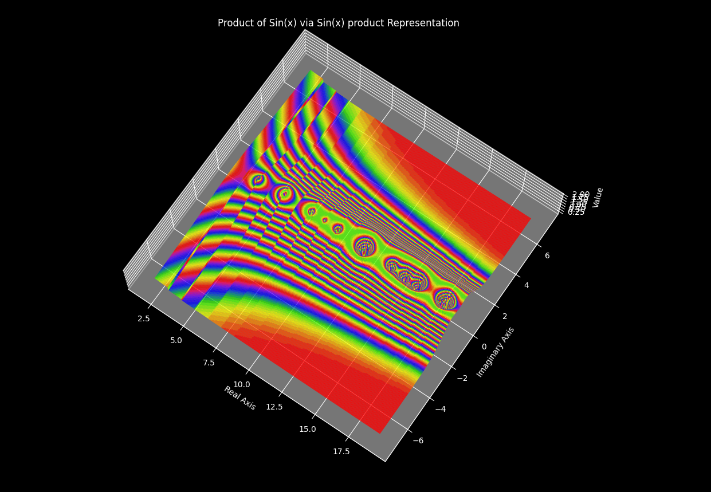
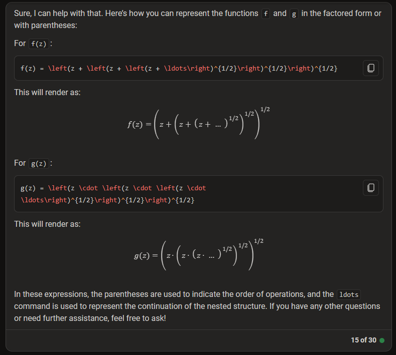

# Getting Started
If you have not already, please download the PDF called:
Divisor_Waves_and_their_Connection_to_the_Riemann_Hypothesis.pdf

I have been working hard on these proofs for the past 4 years and now with the advent of ChatGPT which can be tasked with automating the convertion of data types, leveraging this I have had an explosive amount of research opportunities given the swiftness of implementation.
The Special functions software is free and open source.
  
If you want to learn more about the Riemann Hypothesis and the Millenium prize problems you can find them at the following sources:

Riemann Hypothesis:

https://mathworld.wolfram.com/RiemannZetaFunction.html

Clay Maths Institute's Millenium Prize Problems:

https://en.wikipedia.org/wiki/Millennium_Prize_Problems

# Special-Functions
A program for plotting complex functions. This tool provides the plotting functions for 2D and 3D graphics for infinite series such as the Riemann zeta function, 
the infinite product of the product representation for sin(pi*z/n) as well as any other function that can be formulated in the complex plane. The Infinite product plotted throughout the paper known as b(z) acts as an indicator for prime and composite numbers. ultimately we can describe a complex product waveform which contains the attributes of the factorization for any composite number utilizing multivariable factorization.

### Plot Of the Infinite Product of the Product Representation for Sin(pi*x/n) in the 3-D Complex Plane:

  

### Plot Of the Infinite Product of the Product Representation for Sin(pi*x/n) in the 2-D Complex Plane:

  

### Plot Of the Normalized Infinite Product of the Product Representation for Sin(pi*x/n) in the 3-D Complex Plane:

  

### Plot Of the Normalized Infinite Product of Sin(pi*x/n) in the 3-D Complex Plane:

### Plot Of the Cos of the Infinite Product of the product representation of Sin(pi*x/n) in the 3-D Complex Plane:
  
 

Also Here are some relevant sources for the project:

http://www-elsa.physik.uni-bonn.de/~dieckman/InfProd/InfProd.html

https://ocw.mit.edu/courses/18-104-seminar-in-analysis-applications-to-number-theory-fall-2006/58778de0faae6448c3b0bfb1a1ec4f7a_chan.pdf

https://www.jstor.org/stable/3615085

https://osf.io/4afqj/download

https://www.parabola.unsw.edu.au/files/articles/2020-2029/volume-57-2021/issue-2/vol57_no2_3.pdf

https://www.maa.org/sites/default/files/pdf/pubs/monthly_augsep12_page645.pdf

https://mathworld.wolfram.com/DedekindEtaFunction.html

https://mathworld.wolfram.com/InfiniteProduct.html

https://mathworld.wolfram.com/PolygonCircumscribing.html

https://math.stackexchange.com/questions/186292/derivatives-of-the-riemann-zeta-function-at-s-0

https://www.youtube.com/watch?v=BuKgxeer9j8

https://www2.karlin.mff.cuni.cz/~slavik/product/product_integration.pdf

# About Me
My name is Leo Borcherding, I am a Software Developer with experience working on programs for encryption of firmware devices. I have a background in electrical
engineering and my passion is mathematics as well as art. I am developing this software so that we can further our understanding of mathematics, physics, 
and the universe. Please contact me at borchborchmail@gmail.com if you have questions or are able to do something interesting with my software or math. You can also leave feedback on the software in this submission form:

https://docs.google.com/forms/d/e/1FAIpQLSedobin-e8XqIv2AgMWhIrcNq-Pm7fsD63rhjuEiksWMAe9Og/viewform?usp=sf_link

Here is an example of the current capabilities of Bing chat with GPT4:

Ultimately knowledge should be free however it takes a lot of time and work to develop the mathematics, proofs and software required, I would really appreciate 
it, if you feel inclined to donate to help me keep developing this software and writing this paper. You can find the donation link in the file called bitcoin_donation_wallet.txt

Also if you want read my original paper I wrote in 2020 which initially started my journey on the Riemann Hypothesis here:

https://docs.google.com/document/d/1EqDpk-XiKePku2qzsUmaPO4Ejpdq4HKg/edit

and want to see my previous work on tetrahedral famalies from 2017 you can find that here:

https://oeis.org/A287324

https://oeis.org/A287324/a287324_2.pdf
